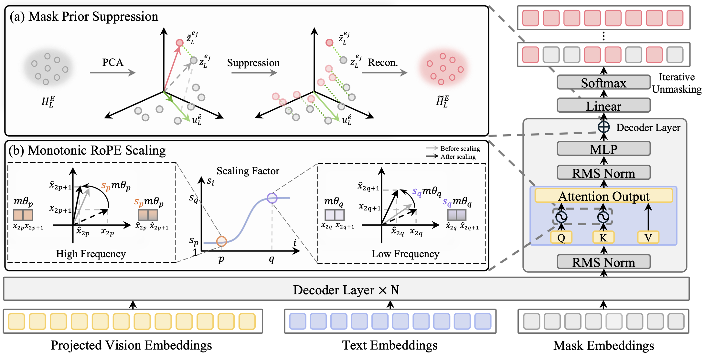

<div align="center">

# Mitigating Mask Prior Drift and Positional Attention Collapse<br/>in Large Diffusion Vision–Language Models

**ICML 2026**

<p>
  <a href="https://noonddudung2.github.io/MPD-PAC/">
    
  </a>
  <a href="https://arxiv.org/abs/XXXX.XXXXX">
    
  </a>
  <!-- <a href="#">
    
  </a> -->
  <a href="#citation">
    
  </a>
</p>

<p>
  <a href="#"><b>Sujung&nbsp;Hong</b></a> ·
  <a href="#"><b>Chanyong&nbsp;Yoon</b></a> ·
  <a href="#"><b>Seongjae&nbsp;Hwang</b></a>
  <br/>
  <sub>Yonsei University</sub>
</p>



</div>

> **TL;DR** — Large Diffusion Vision–Language Models (LDVLMs) collapse into repetitive text
> and weak visual grounding because (1) mask token hidden states drift toward a shared
> prior, and (2) RoPE concentrates attention on nearby mask tokens. We fix both at
> **inference time, with no retraining**, via **Mask Prior Suppression** and
> **Monotonic RoPE Scaling**.

---

## Abstract

Large diffusion vision–language models (LDVLMs) enable parallel decoding and
bidirectional attention, yet their behavior under long-form generation remains
underexplored. We show that existing LDVLMs suffer from **repetitive generation**
and **degraded visual grounding**, driven by two causes: a **mask token prior** that
pulls hidden representations toward a shared direction over generation steps, and a
misalignment between the **positional attention bias** and the iterative unmasking
process that suppresses attention to informative visual tokens.

We propose a training-free approach — **Mask Prior Suppression** and
**Monotonic RoPE Scaling** — that mitigates mask prior drift and positional
attention collapse during decoding. Experiments on multimodal benchmarks and
visual grounding tasks show consistent gains over baselines, with robust
improvements on long-form description — all from a lightweight, **plug-and-play**
strategy that requires no additional training and generalizes across diverse
LDVLM architectures.

---

## Method

Two inference-time interventions, both training-free and plug-and-play:

### Mask Prior Suppression
The hidden state of every mask token in the final layer is projected onto a
low-rank **mask-prior subspace** (built once via PCA over layer-wise means of the
vocabulary-mean embedding) and suppressed adaptively by cosine similarity:

$$\tilde{h}_L^{e_j} \;=\; h_L^{e_j} \;-\; \lambda \, \cos(\theta_j) \, \mathbf{U}\mathbf{U}^{\!\top}\!\bigl(h_L^{e_j} - \mu\bigr).$$

Only **~0.07%** of final-layer dimensions are touched (k = 3 of d = 4096).

### Monotonic RoPE Scaling
A sigmoid-gated scaling that amplifies low-frequency RoPE components more strongly
than high-frequency ones, restoring long-range attention to distant visual tokens
while preserving RoPE's relative-distance structure:

$$s_i \;=\; 1 + \beta \, \sigma\!\bigl(\eta(\tau_i - \tau_0)\bigr), \qquad \tau_i = \frac{i}{d/2 - 1}.$$

---

## Results

Consistent improvements across **nine benchmarks** on both LLaDA-V and LaViDa, with
the largest gains on visual grounding and long-form generation.

| Model | RefCOCOg ↑ | Ferret ↑ | LLaVA-Bench ↑ | DetailCaps ↑ | MIA ↑ |
|:--|:-:|:-:|:-:|:-:|:-:|
| LLaDA-V | 64.8 | 60.4 | 61.3 | 59.8 | 66.1 |
| **+ Ours** | **65.0** | **62.9** | **64.1** | **63.6** | **67.0** |
| LaViDa | 36.9 | 25.9 | 39.5 | 8.3 | 49.4 |
| **+ Ours** | **44.0** | **35.7** | **46.5** | **56.1** | **57.3** |

Highest absolute gains on **LaViDa**: DetailCaps **+47.8**, Ferret **+9.8**, MIA **+7.9**.
See the [project page](https://noonddudung2.github.io/MPD-PAC/) for the full table,
ablations, and qualitative examples.

---

## Repository Layout

```
MPD-PAC/
├── LLaDA-V/        # LLaDA-V integration — entry: generate_demo_ours.py
├── LaViDa/         # LaViDa integration  — entry: predict_ours.py
├── docs/           # Project page (GitHub Pages)
└── assets/         # Overview figure used in this README
```

Each model integration is a partial fork of upstream `llava` and is run from inside
its own directory with its own conda environment.

---

## Installation

### LLaDA-V

```bash
git clone https://github.com/ML-GSAI/LLaDA-V.git
cd LLaDA-V/train
bash init_env.sh
```

See the [LLaDA-V repository](https://github.com/ML-GSAI/LLaDA-V) for full setup details.

### LaViDa

```bash
conda create --name lavida python=3.13
conda activate lavida

git clone https://github.com/jacklishufan/LaViDa.git
pip install -e .[train]
cd eval && pip install -e . && cd ..
pip install trl==0.17.0
```

See the [LaViDa repository](https://github.com/jacklishufan/LaViDa) for full setup details.

---

## Inference

Both demo scripts run the baseline first (`prior=0.0, rope=0.0`) and then the same
model with our method enabled — so each run produces a **side-by-side comparison**
in stdout.

### LLaDA-V + Ours

```bash
cd LLaDA-V
python generate_demo_ours.py
```

### LaViDa + Ours

```bash
cd LaViDa
python predict_ours.py
```

### Method hyperparameters

The following kwargs are threaded through `model.generate(...)`:

| arg | type | description |
|---|---|---|
| `prior` | float | Mask Prior Suppression strength (0.0 disables) |
| `rope` | float | Monotonic RoPE Scaling strength (0.0 disables) |
| `mode` | str | RoPE frequency-mask shape: `linear \| power \| exp \| sigmoid \| cosine` |
| `slope`, `center` | float | sigmoid band parameters (only used when `mode="sigmoid"`) |
| `k` | int | PCA rank for the prior subspace (LLaDA-V only) |

Defaults used in the paper: `mode="sigmoid"`, `slope=8.0`, `center=0.6`,
`k=3`, per-backbone (`λ`, `β`) values described in §6 of the paper.

---

## Citation <a id="citation"></a>

If you find this work useful, please cite:

```bibtex
@misc{mpdpac2026,
  title         = {Mitigating Mask Prior Drift and Positional Attention Collapse
                   in Large Diffusion Vision-Language Models},
  author        = {Hong, Sujung and Yoon, Chanyong and Hwang, Seongjae},
  year          = {2026},
  eprint        = {XXXX.XXXXX},
  archivePrefix = {arXiv},
  primaryClass  = {cs.CV}
}
```

---

## Acknowledgments

This project builds on the upstream
[LLaDA-V](https://github.com/ML-GSAI/LLaDA-V),
[LaViDa](https://github.com/jacklishufan/LaViDa),
and the broader `llava` codebase. We thank the authors for releasing their code.

The project page design is adapted from the
[Academic Project Page Template](https://github.com/eliahuhorwitz/Academic-project-page-template).
